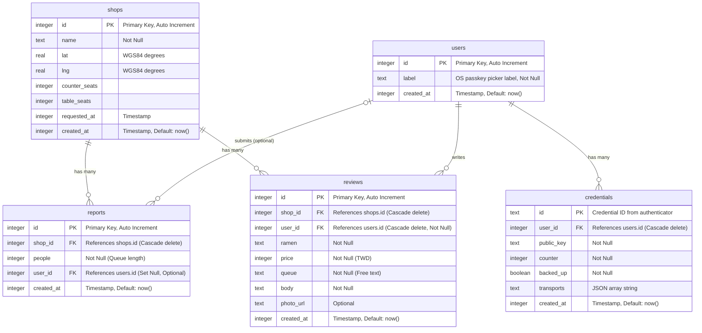

# 🍜 Ramen-now Database ER Model

This diagram visualizes the relationships and schema definitions found in the Drizzle ORM configuration (`server/database/schema.ts`).

```mermaid
erDiagram
    shops ||--o{ reports : "has many"
    shops ||--o{ reviews : "has many"
    users ||--o{ credentials : "has many"
    users |o--o{ reports : "submits (optional)"
    users ||--o{ reviews : "writes"

    shops {
        integer id PK "Primary Key, Auto Increment"
        text name "Not Null"
        real lat "WGS84 degrees"
        real lng "WGS84 degrees"
        integer counter_seats
        integer table_seats
        integer requested_at "Timestamp"
        integer created_at "Timestamp, Default: now()"
    }

    users {
        integer id PK "Primary Key, Auto Increment"
        text label "OS passkey picker label, Not Null"
        integer created_at "Timestamp, Default: now()"
    }

    credentials {
        text id PK "Credential ID from authenticator"
        integer user_id FK "References users.id (Cascade delete)"
        text public_key "Not Null"
        integer counter "Not Null"
        boolean backed_up "Not Null"
        text transports "JSON array string"
        integer created_at "Timestamp, Default: now()"
    }

    reports {
        integer id PK "Primary Key, Auto Increment"
        integer shop_id FK "References shops.id (Cascade delete)"
        integer people "Not Null (Queue length)"
        integer user_id FK "References users.id (Set Null, Optional)"
        integer created_at "Timestamp, Default: now()"
    }

    reviews {
        integer id PK "Primary Key, Auto Increment"
        integer shop_id FK "References shops.id (Cascade delete)"
        integer user_id FK "References users.id (Cascade delete, Not Null)"
        text ramen "Not Null"
        integer price "Not Null (TWD)"
        text queue "Not Null (Free text)"
        text body "Not Null"
        text photo_url "Optional"
        integer created_at "Timestamp, Default: now()"
    }
```
